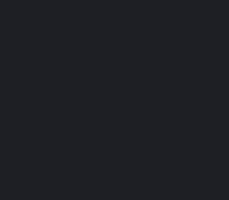

# Bitnight Rambler

Tiny pixel-art ramblers that roam the edges of your terminal.

`rambit` is a small animation engine written in Zig with no dependencies
beyond the standard library. Sprites are plain text files, so a new rambler
is data, not code.



> **Status:** proof of concept. See [ABSTRACT.md](ABSTRACT.md) for the
> design goals.

## Build

Requires [Zig 0.16.0](https://ziglang.org/download/).

```sh
zig build                          # builds zig-out/bin/rambit
zig build run -- cat               # builds and runs
zig build test                     # unit tests, including every built-in rambler
zig build validate                 # rambit validate ramblers
zig build -Doptimize=ReleaseSmall  # a standalone binary of under 300 KB
```

Tested on Linux. It also builds for macOS, but has not been tried there
yet. Windows is not supported yet.

### With Nix

The flake provides Zig 0.16.0 and ZLS for x86_64-linux, aarch64-linux
and aarch64-darwin:

```sh
nix develop          # a shell with zig and zls
direnv allow         # or let direnv load it whenever you cd in (.envrc)
nix build            # ./result/bin/rambit, after running the tests
nix run . -- cat
nix flake check
```

## Usage

```sh
rambit cat              # q, Esc or Ctrl-C sends it home
rambit slime --once     # cross the bottom once and exit, like sl
rambit ghost --seed 42  # the same seed gives the same stroll
rambit list             # the built-in ramblers
rambit preview cat      # print every frame, e.g. to review a pull request
rambit validate         # check the built-in ramblers, or given directories
```

| Option           | Meaning                                                      |
| ---------------- | ------------------------------------------------------------ |
| `--once`         | Cross the screen once along the bottom and exit.             |
| `--seed <n>`     | Seed the movement for a reproducible run.                    |
| `--color <mode>` | `auto` (default), `truecolor` or `256`. `auto` uses 24-bit color when `COLORTERM` is `truecolor` or `24bit`. |

A rambler runs on the alternate screen, like `less` or `vim`, so your
terminal looks exactly as before once it leaves.

## Adding a rambler

Make a directory under `ramblers/`. The build embeds every directory there,
so no code needs to change:

```text
ramblers/cat/
├── manifest.json
├── idle-0.sprite
├── walk-0.sprite
└── ...
```

Only `manifest.json` and the `.sprite` files are embedded; the build
ignores anything else in the directory, such as a README or credits.

While drawing, run it straight from the directory, without rebuilding:

```sh
rambit preview ./ramblers/cat   # every frame side by side
rambit ./ramblers/cat           # the real thing
rambit validate ramblers/cat    # what is wrong, with file:line:column
```

### manifest.json

```json
{
  "id": "cat",
  "name": "Cat",
  "description": "A little tabby that strolls around the edges of your terminal.",
  "width": 16,
  "height": 12,
  "facing": "right",
  "palette": {
    "k": "#3b2730",
    "o": "#f2a65a",
    "d": "#c8743a",
    "w": "#ffe9c7",
    "p": "#f497a9"
  },
  "animations": {
    "idle": { "frames": ["idle-0", "idle-0", "idle-0", "idle-1", "idle-0", "idle-0", "idle-2", "idle-2"], "frame_ms": 400 },
    "walk": { "frames": ["walk-0", "walk-1", "walk-2", "walk-3"], "frame_ms": 140 },
    "run": { "frames": ["run-0", "run-1"], "frame_ms": 110 },
    "sleep": { "frames": ["sleep-0", "sleep-1"], "frame_ms": 800 },
    "jump": { "frames": ["run-1", "run-0"], "frame_ms": 120 }
  },
  "wall_animations": {
    "walk": { "frames": ["climb-0", "climb-1", "climb-2", "climb-3"], "frame_ms": 160 },
    "jump": { "frames": ["climb-1", "climb-0"], "frame_ms": 120 }
  },
  "ceiling_animations": {
    "walk": { "frames": ["ceiling-walk-0", "ceiling-walk-1", "ceiling-walk-2", "ceiling-walk-3"], "frame_ms": 140 }
  },
  "motion": { "speed": 9, "run_speed": 20 }
}
```

| Field          | Required | Meaning |
| -------------- | -------- | ------- |
| `id`           | yes      | Lowercase letters, digits and `-`. Must match the directory name. |
| `name`         | yes      | Display name. |
| `description`  | no       | Shown by `rambit list`. |
| `width`, `height` | yes   | Size of every frame in pixels, 1 to 64. |
| `facing`       | no       | `right` (default) or `left`: the direction the frames are drawn facing. They are mirrored automatically for the other direction. |
| `palette`      | yes      | Single-character symbols mapped to `#rrggbb` colors. |
| `animations`   | yes      | The floor's animations: `idle`, `walk`, `run`, `sleep` and `jump`. At least one of `idle` or `walk` is required, and each falls back to the other; the others are optional. |
| `wall_animations` | no    | The same kinds and rules, for the walls. With these the rambler climbs them. |
| `ceiling_animations` | no | The same again, for the ceiling. The ceiling is reached by a wall, so this needs `wall_animations` too. |
| `edges`        | no       | The edges to walk along: any of `bottom`, `left`, `right` and `top`. Must include `bottom`; the walls need `wall_animations`, and `top` needs `ceiling_animations` and `left` or `right`. Defaults to every edge the rambler has animations for. |
| `frames`       | yes      | Sprite file names without `.sprite`. Repeat a name to hold a frame longer. |
| `frame_ms`     | no       | Milliseconds per frame, 20 to 10000. Defaults to 150. |
| `motion.speed` | no       | Pixels (terminal columns) per second, 1 to 64. Defaults to 8. |
| `motion.run_speed` | no   | Pixels per second while running, 1 to 64. Defaults to twice `speed`, at most 64. |
| `motion.jump_height` | no | How high a jump goes, in pixels, 1 to 64. Defaults to half the `height`, at least 1. |

`walk` plays while the rambler moves, and `idle` while it rests. The other
three are optional, and a rambler only does what it has an animation for:
with `run` it sets off at `run_speed` now and then, with `sleep` some rests
end in a longer nap, and with `jump` it sometimes leaps `jump_height`
pixels up while on the move. `jump` starts from its first frame at every
takeoff and holds its last frame until the rambler lands. Without `idle` a
rambler never rests, but with `sleep` it still stops for the odd nap. With
`--once`, ramblers only walk, and only along the bottom. A rambler does
not need legs: the slime hops and the ghost floats through the same `walk`
animation.

With `wall_animations` a rambler also climbs the walls, and with
`ceiling_animations` as well it crosses the ceiling, so with every edge it
can go all the way round. It always comes in along the bottom, and goes
round the corners from one edge to the next. On each edge it uses that
surface's animations, and only rests, sleeps, runs or jumps where it has
the animation for it: `idle` and `walk` fall back to each other within a set,
and a run turns into a walk when it comes round a corner onto a surface
without `run`. Jumps go away from the edge, toward the middle of the
screen, and never round a corner. The cat, for example, climbs and jumps
on the walls but only walks on the ceiling, so it only rests and sleeps on
the floor.

### Sprites

One line of text per pixel row. `.` is transparent, which shows the
terminal's own background; every other character must be in the palette.

```text
..........k...k.
.k.......kpkkkpk
kok......koooook
kok......kokokok
```

Each terminal cell shows two pixels stacked vertically, so a 16×12 sprite
takes up 16 columns and 6 rows.

#### Wall and ceiling frames

Frames are never rotated: the engine only mirrors them and turns them
upside down. Turning the floor frames a quarter turn would leave a
climber lying on its side, lit from the wrong way, so each surface has
frames of its own and you draw the rambler as it should look there.

Wall frames are `height` pixels wide and `width` pixels tall. Draw them
on the right-hand wall heading up, with the wall on the right: the cat
climbs with its paws on the wall, and the ghost drifts up with its back to
it. They are mirrored for the left wall, and turned upside down on the way
down, so a face that reads either way up helps: the slime keeps its eyes
level, and the ghost has a flat mouth on the walls.

Ceiling frames are `width` by `height`, like floor frames, and are drawn
as they should look against the top of the screen, facing `facing`. They
are mirrored for the other direction, but never turned upside down, so
that is up to you: the cat walks upside down, while the ghost floats
upright with its head brushing the ceiling.

### Validation

`rambit validate` and `zig build test` check the manifest syntax (with the
line and column of JSON errors), required and unknown fields, value ranges,
frame dimensions (`height` by `width` for wall frames), palette symbols,
missing frame files, frame names, `edges` that lack their animations, leave
out `bottom` or have a ceiling without a wall, ids that do not match their
directory or clash with a command or another rambler, and file size
limits. Sprite files no animation uses produce a warning, as do wall or
ceiling animations no edge uses, `motion.run_speed` without a `run`
animation and `motion.jump_height` without a `jump` animation.

CI runs `zig build validate` and `zig build test` on every pull request
and every push to `main`, so a pull request shows these problems before
it is merged.

## How it works

- **Rendering.** Ramblers are drawn into a framebuffer of logical pixels.
  Every terminal cell shows two pixels using `▀` and `▄` with ANSI
  foreground and background colors. Only cells that changed since the last
  frame are written.
- **Movement and animation are separate.** The movement logic decides where
  to go and whether to walk, run, jump, rest or sleep; the rambler provides
  the frames. Movement advances in fixed 30 Hz steps from a seeded random
  number generator, so a run is reproducible.
- **One line round the edges.** The edges a rambler walks are unrolled
  into one line of positions, so climbing a wall is just going further
  along it. Each frame is then placed against the edge the position lies
  on, and flipped to face the way it is going.
- **Terminal handling.** Raw input, the alternate screen, a hidden cursor
  and no line wrapping while running. The terminal is restored on exit,
  including on `SIGINT`, `SIGTERM`, `SIGHUP` and panics. Resizes are picked
  up through `SIGWINCH`.
- **Single binary.** `build.zig` scans `ramblers/` and generates a module
  that embeds every manifest and sprite with `@embedFile`.

```text
src/
├── main.zig         CLI: play, list, preview, validate
├── play.zig         the animation loop
├── Actor.zig        movement: walking, climbing, running, jumping, resting, sleeping
├── Track.zig        the edges as one line, and where frames go
├── Rambler.zig      manifest parsing and validation
├── sprite.zig       sprite file parsing
├── Source.zig       embedded files or a directory on disk
├── Diagnostics.zig  problems collected by the validator
├── Canvas.zig       the logical pixel framebuffer
├── Screen.zig       pixels to cells, and cells to escape sequences
├── Terminal.zig     raw mode, alternate screen, signals, terminal size
└── color.zig        colors, palettes, 256-color fallback
```

## Not yet

- A pseudo-terminal mode where ramblers share the screen with your shell,
  as described in the abstract, is a later-stage feature.
